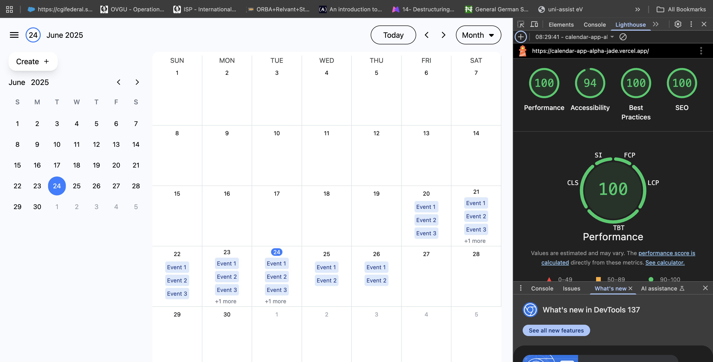

# React Calendar App

## Overview

This is a React-based calendar events application that allows users to create, view, and manage calendar events with time slots. It uses React Context API for state management, providing modular and maintainable code architecture.

---

## Setup & Running Instructions

### Clone the repository

```sh
git clone https://github.com/mrvicthor/calendar-app
cd calendar-app
```

### install dependencies

```sh
 npm install
```

## Run the development server

```sh
npm run dev
```

## Run test

```sh
npx vitest
```

## Screenshot - Lighthouse Report



## Architecture & Design Decisions

State Management:

The app uses React's Context API combined with React's useState hooks to manage global calendar state (CalendarContext) and event data (EventsContext). This keeps state localized to relevant contexts, avoiding prop drilling while maintaining simple and performant updates.

Component Structure:

Components are organized by feature and responsibility. For example, the CreateEvent component handles event creation logic and UI, relying on context hooks to access and mutate shared state. This modular structure promotes reusability and testability.

Time Handling:

Time inputs and validation are managed with utility functions converting time strings to minutes for easy comparison, ensuring start times are always earlier than end times.

Testing:

Tests use React Testing Library with context providers mocked or implemented as test utilities, ensuring realistic behavior during UI interactions.

## Known Issues, Limitations & Assumptions

### Date & Time Validation:

Currently, the app does not support timezone handling.

### Performance:

For very large event datasets, the current in-memory state and filtering logic may not scale well.

### UI/UX:

The UI is basic and may require improvements for accessibility and responsive design.

### Assumptions:

Event IDs are generated locally and not persisted externally.
